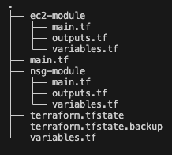
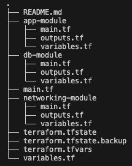

# **Terraform**

- [**Terraform**](#terraform)
  - [**What is Terraform? What is it used for?**](#what-is-terraform-what-is-it-used-for)
    - [**Use Cases of Terraform:**](#use-cases-of-terraform)
  - [**Why Use Terraform? The Benefits**](#why-use-terraform-the-benefits)
    - [**1. Infrastructure as Code (IaC)**](#1-infrastructure-as-code-iac)
    - [**2. Multi-Cloud Support**](#2-multi-cloud-support)
    - [**3. Declarative Configuration**](#3-declarative-configuration)
    - [**4. State Management**](#4-state-management)
    - [**5. Modular and Reusable Code**](#5-modular-and-reusable-code)
    - [**6. Change Automation and Plan Execution**](#6-change-automation-and-plan-execution)
    - [**7. Idempotency**](#7-idempotency)
  - [**Alternatives to Terraform**](#alternatives-to-terraform)
  - [**Who is Using Terraform in the Industry?**](#who-is-using-terraform-in-the-industry)
  - [**In IaC, What is Orchestration? How Does Terraform Act as an Orchestrator?**](#in-iac-what-is-orchestration-how-does-terraform-act-as-an-orchestrator)
    - [**Terraform as an Orchestrator:**](#terraform-as-an-orchestrator)
  - [**Best Practice for Supplying AWS Credentials to Terraform**](#best-practice-for-supplying-aws-credentials-to-terraform)
    - [**Best Practices for Providing AWS Credentials:**](#best-practices-for-providing-aws-credentials)
  - [**AWS Credential Lookup Order in Terraform**](#aws-credential-lookup-order-in-terraform)
    - [**How AWS Credentials Should NEVER Be Passed to Terraform**](#how-aws-credentials-should-never-be-passed-to-terraform)
  - [**Why Use Terraform for Different Environments (Production, Testing, etc.)?**](#why-use-terraform-for-different-environments-production-testing-etc)
    - [**How Terraform Manages Multiple Environments:**](#how-terraform-manages-multiple-environments)
  - [**Conclusion**](#conclusion)
  - [Task: Deploy ec2 instance with new nsg using terraform](#task-deploy-ec2-instance-with-new-nsg-using-terraform)
    - [Directory layout](#directory-layout)
    - [EC2 module](#ec2-module)
    - [NSG module](#nsg-module)
    - [Root](#root)
  - [Task: Create 2-tier architecture on Azure with Terraform](#task-create-2-tier-architecture-on-azure-with-terraform)
    - [Directory layout](#directory-layout-1)
    - [Networking module](#networking-module)
    - [Db module](#db-module)
    - [App module](#app-module)
    - [Root](#root-1)

## **What is Terraform? What is it used for?**

Terraform is an **open-source Infrastructure as Code (IaC) tool** developed by HashiCorp. It is used to automate the provisioning, configuration, and management of cloud and on-premises infrastructure. Terraform allows users to define their infrastructure using a declarative configuration language called **HashiCorp Configuration Language (HCL)**.

### **Use Cases of Terraform:**

- **Cloud Resource Provisioning**: Automate the deployment of AWS, Azure, and Google Cloud resources.
- **Multi-Cloud Management**: Manage infrastructure across multiple cloud providers.
- **Infrastructure Automation**: Eliminate manual configuration by defining infrastructure as code.
- **Version-Controlled Infrastructure**: Track infrastructure changes using Git.
- **CI/CD Pipelines**: Integrate Terraform into CI/CD workflows for automated deployments.
- **State Management**: Maintain a state file to track resource dependencies and changes.

---

## **Why Use Terraform? The Benefits**

### **1. Infrastructure as Code (IaC)**

- Ensures consistency across deployments.
- Allows infrastructure to be defined, versioned, and reviewed like application code.

### **2. Multi-Cloud Support**

- Terraform is cloud-agnostic, meaning it can provision resources across AWS, Azure, GCP, and more using a unified approach.

### **3. Declarative Configuration**

- Users define **desired state** rather than writing scripts to provision resources imperatively.

### **4. State Management**

- Terraform keeps track of the current state of infrastructure using a **state file (********`terraform.tfstate`********\*\*\*\*\*\*\*\*)**.
- This helps in detecting and applying changes efficiently.

### **5. Modular and Reusable Code**

- Terraform allows code to be modularized using **modules**, making it easier to reuse and manage infrastructure.

### **6. Change Automation and Plan Execution**

- Terraform provides **`terraform plan`**, which shows expected changes before applying them.
- **`terraform apply`** ensures that only planned changes are executed.

### **7. Idempotency**

- Running Terraform multiple times results in the same state, reducing drift and unexpected changes.

---

## **Alternatives to Terraform**

While Terraform is widely used, there are other IaC tools available:

| **Tool**                            | **Description**                                         |
| ----------------------------------- | ------------------------------------------------------- |
| **AWS CloudFormation**              | AWS-native IaC tool for managing AWS resources.         |
| **Pulumi**                          | Supports multiple languages (Python, TypeScript, etc.). |
| **Ansible**                         | Configuration management tool, supports provisioning.   |
| **Chef/Puppet**                     | More focused on configuration management.               |
| **Google Cloud Deployment Manager** | GCP-native IaC tool.                                    |
| **Azure Resource Manager (ARM)**    | Azure-native IaC tool.                                  |

---

## **Who is Using Terraform in the Industry?**

Terraform is widely adopted by companies of all sizes, including:

- **Tech Giants**: Google, Microsoft, Amazon, Netflix.
- **Financial Services**: JPMorgan Chase, Capital One.
- **Retail & E-commerce**: Shopify, Walmart.
- **Startups & Cloud-native Companies**: HashiCorp, Datadog.
- **Enterprise IT**: IBM, Oracle.

---

## **In IaC, What is Orchestration? How Does Terraform Act as an Orchestrator?**

**Orchestration** in Infrastructure as Code (IaC) refers to **managing multiple infrastructure components in a coordinated way**, ensuring they interact correctly.

### **Terraform as an Orchestrator:**

- Defines **dependencies between resources** and provisions them in the correct order.
- Uses **state management** to track changes and reconcile differences.
- Automates **resource provisioning and scaling** (e.g., creating an EC2 instance, configuring networking, and deploying apps in a sequence).
- Supports **multi-cloud orchestration**, allowing resources from different cloud providers to be managed in a single workflow.

---

## **Best Practice for Supplying AWS Credentials to Terraform**

Terraform requires AWS credentials to interact with AWS APIs.

### **Best Practices for Providing AWS Credentials:**

1. **Use AWS IAM Roles (Best Practice for Cloud Environments)**

   - Assign an **IAM role** to the EC2 instance or CI/CD runner that executes Terraform.
   - No need to store credentials in files or environment variables.

2. **Use Environment Variables (Preferred for Local Development)**

   ```sh
   export AWS_ACCESS_KEY_ID=your-access-key
   export AWS_SECRET_ACCESS_KEY=your-secret-key
   ```

3. **Use AWS Profile (Secure for Developers)**

   - Configure credentials in `~/.aws/credentials`.

   ```sh
   [default]
   aws_access_key_id=your-access-key
   aws_secret_access_key=your-secret-key
   ```

   - Set profile in Terraform:

   ```hcl
   provider "aws" {
     profile = "default"
   }
   ```

4. **Use Terraform Cloud & Remote Backends for Secret Management**

   - Store credentials securely in Terraform Cloud or use a **remote backend** like AWS S3 with KMS encryption.

---

## **AWS Credential Lookup Order in Terraform**

Terraform searches for AWS credentials in the following order (higher precedence first):

1. **Environment Variables** (`AWS_ACCESS_KEY_ID`, `AWS_SECRET_ACCESS_KEY`).
2. **Terraform Variable Definitions (********`.tfvars`********\*\*\*\*\*\*\*\*)**.
3. **AWS Credentials File (********`~/.aws/credentials`********\*\*\*\*\*\*\*\*)**.
4. **IAM Role (Instance Profile)** (if running inside AWS infrastructure like EC2 or Lambda).
5. **Default Credentials Chain in AWS SDK**.

### **How AWS Credentials Should NEVER Be Passed to Terraform**

❌ **Do not hardcode credentials in Terraform files (********`.tf`********\*\*\*\*\*\*\*\* files)**:

```hcl
provider "aws" {
  access_key = "hardcoded-access-key"
  secret_key = "hardcoded-secret-key"
}
```

- This exposes credentials in source control and is a security risk.
- Instead, use **IAM roles, environment variables, or AWS profiles**.

---

## **Why Use Terraform for Different Environments (Production, Testing, etc.)?**

Using Terraform for multiple environments ensures:

- **Consistency**: All environments are configured identically.
- **Isolation**: Different environments run in separate workspaces or accounts.
- **Scalability**: Testing infrastructure can be scaled separately from production.
- **Cost Efficiency**: Non-production environments can be shut down automatically.

### **How Terraform Manages Multiple Environments:**

1. **Use Workspaces**:

   ```sh
   terraform workspace new dev
   terraform workspace select dev
   ```

2. **Use Separate State Files**:
   - Store state files in separate S3 buckets for each environment.
3. **Use Variables for Environment-Specific Configurations**:

   ```hcl
   variable "environment" {}
   provider "aws" {
     region = var.environment == "prod" ? "us-east-1" : "us-west-2"
   }
   ```

---

## **Conclusion**

Terraform is a powerful, cloud-agnostic IaC tool that simplifies infrastructure automation. By following best practices for **AWS credential management**, **environment separation**, and **orchestration**, teams can efficiently manage and scale infrastructure while ensuring security and maintainability.

## Task: Deploy ec2 instance with new nsg using terraform

- Terraform overview:


- Use modular approach with separate module for ec2 and nsg.
- Terraform commands executed at root level.

### Directory layout



### EC2 module

- main.tf:

```hcl
variable "security_group_id" {
  description = "The ID of the security group to associate with the instance"
  type        = string
}

provider "aws" {
  region = "eu-west-1"
}

resource "aws_instance" "app_instance" {
  ami                         = "ami-0c1c30571d2dae5c9"
  instance_type               = "t3.micro"
  associate_public_ip_address = true
  key_name                    = "tech501-sameem-aws-key"
  vpc_security_group_ids      = [var.security_group_id]
  tags = {
    Name = "tech501-sameem-terraform-app"
  }
}
```

### NSG module

- main.tf:

```hcl
provider "aws" {
  region = "eu-west-1"
}

data "aws_vpc" "default" {
  default = true
}

resource "aws_security_group" "app_sg" {
  name        = var.sg_name
  description = var.description
  vpc_id      = data.aws_vpc.default.id

  ingress {
    from_port   = 22
    to_port     = 22
    protocol    = "tcp"
    cidr_blocks = var.ingress_ssh
  }

  ingress {
    from_port   = 3000
    to_port     = 3000
    protocol    = "tcp"
    cidr_blocks = var.ingress_nodejs
  }

  ingress {
    from_port   = 80
    to_port     = 80
    protocol    = "tcp"
    cidr_blocks = var.ingress_http
  }

  egress {
    from_port   = 0
    to_port     = 0
    protocol    = "-1"
    cidr_blocks = var.egress_all
  }
}
```

### Root

- main.tf:

```hcl
terraform {
  required_providers {
    aws = {
      source  = "hashicorp/aws"
      version = "3.56.0"
    }
  }
}

provider "aws" {
  region = "eu-west-1"

}

module "nsg" {
  source         = "./nsg-module"
  ingress_http   = var.ingress_http
  egress_all     = var.egress_all
  ingress_nodejs = var.ingress_nodejs
  ingress_ssh    = var.ingress_ssh
  sg_name        = var.sg_name
  description    = var.description
}

module "ec2" {
  source            = "./ec2-module"
  ami               = var.ami
  instance_type     = var.instance_type
  key_name          = var.key_name
  instance_name     = var.instance_name
  associate_public_ip_address = var.associate_public_ip_address
  security_group_id = module.nsg.security_group_id
}
```

## Task: Create 2-tier architecture on Azure with Terraform

1. Install Azure CLI.
2. Open terminal and run: `az login`.
   - This should open a browser window for azure authentication via AD, which will bypass any need for sensitive credentials in provider block.

### Directory layout

- See below:



### Networking module

- main.tf:

```hcl
resource "azurerm_public_ip" "app_ip" {
  name                = "tech501-sameem-terraform-app-public-ip"
  resource_group_name = var.resource_group_name
  location            = var.location
  allocation_method   = "Dynamic"
}

resource "azurerm_network_interface" "app_nic" {
  name                = "tech501-sameem-terraform-app-nic"
  resource_group_name = var.resource_group_name
  location            = var.location

  ip_configuration {
    name                          = "tech501-sameem-terraform-app-nic-ip"
    subnet_id                     = var.app_subnet_id
    private_ip_address_allocation = "Dynamic"
    public_ip_address_id          = azurerm_public_ip.app_ip.id
  }
}

resource "azurerm_network_interface" "db_nic" {
  name                = "tech501-sameem-terraform-app-db-nic"
  resource_group_name = var.resource_group_name
  location            = var.location

  ip_configuration {
    name                          = "tech501-sameem-terraform-app-db-nic-ip"
    subnet_id                     = var.db_subnet_id
    private_ip_address_allocation = "Static"
    private_ip_address            = var.private_ip_address
  }
}

resource "azurerm_network_interface_security_group_association" "app_nsg_assoc" {
  network_interface_id      = azurerm_network_interface.app_nic.id
  network_security_group_id = var.app_network_security_group_id
}

resource "azurerm_network_interface_security_group_association" "db_nsg_assoc" {
  network_interface_id      = azurerm_network_interface.db_nic.id
  network_security_group_id = var.db_network_security_group_id
}
```

- where possible, have used existing networking resources on azure e.g. nsg, else they are created as above defined by resource block.
- can see app_nic has been provided public IP, db_nic has not. It has fixed static IP.
- need to associate nsg with the nic (see last two resources above)
- these networking components are dependencies for the db vm and app vm.

### Db module

- main.tf:

```hcl
resource "azurerm_linux_virtual_machine" "vm" {
  name                  = "tech501-sameem-terraform-app-db-vm"
  resource_group_name   = var.resource_group_name
  location              = var.location
  size                  = "Standard_B1s"
  admin_username        = "adminuser"
  network_interface_ids = [var.network_interface_id]
  os_disk {
    caching              = "ReadWrite"
    storage_account_type = "StandardSSD_LRS"
  }
  source_image_id = var.db_source_image_id
  computer_name   = "sameem-db-vm"

  admin_ssh_key {
    username   = "adminuser"
    public_key = var.public_key
  }
}
```

- only created after networking resources provisioned
- ensure image source is correctly referenced (existing db custom image on azure).
- ssh key already exists in azure hence referenced as such.
- other standard config for db vm.

### App module

- main.tf:

```hcl
resource "azurerm_linux_virtual_machine" "vm" {
  name                  = "tech501-sameem-terraform-app-vm"
  resource_group_name   = var.resource_group_name
  location              = var.location
  size                  = "Standard_B1s"
  admin_username        = "adminuser"
  network_interface_ids = [var.network_interface_id]
  os_disk {
    caching              = "ReadWrite"
    storage_account_type = "StandardSSD_LRS"
  }
  source_image_id = var.app_source_image_id
  computer_name   = "sameem-app-vm"

  admin_ssh_key {
    username   = "adminuser"
    public_key = var.public_key
  }

  custom_data = base64encode(var.custom_data)
}
```

- only created after db vm is provisioned
- custom (user) data provided for initial vm setup so app is ready to access as vm is created
- ensure correct source image id is referenced as contains app code and other dependencies.
- use existing ssh key
- other standard app vm config.

### Root

- main.tf:

```hcl
terraform {
  required_providers {
    azurerm = {
      source  = "hashicorp/azurerm"
      version = "~> 3.0"
    }
  }
  required_version = ">= 1.0.0"
}

provider "azurerm" {
  features {}
  skip_provider_registration = true
}

data "azurerm_resource_group" "rg" {
  name = "tech501"
}

data "azurerm_virtual_network" "vnet" {
  name                = "tech501-sameem-2-subnet-vnet"
  resource_group_name = data.azurerm_resource_group.rg.name
}

data "azurerm_subnet" "public_subnet" {
  name                 = "public-subnet"
  virtual_network_name = data.azurerm_virtual_network.vnet.name
  resource_group_name  = data.azurerm_resource_group.rg.name
}

data "azurerm_subnet" "private_subnet" {
  name                 = "private-subnet"
  virtual_network_name = data.azurerm_virtual_network.vnet.name
  resource_group_name  = data.azurerm_resource_group.rg.name
}

data "azurerm_network_security_group" "app_nsg" {
  name                = "tech501-sameem-in-3-subnet-sparta-app-nsg"
  resource_group_name = data.azurerm_resource_group.rg.name
}

data "azurerm_network_security_group" "db_nsg" {
  name                = "tech501-sameem-in-3-subnet-sparta-app-db-nsg"
  resource_group_name = data.azurerm_resource_group.rg.name

}

data "azurerm_ssh_public_key" "ssh" {
  name                = "tech501-sameem-az-key"
  resource_group_name = data.azurerm_resource_group.rg.name
}

module "networking" {
  source                        = "./networking-module"
  resource_group_name           = data.azurerm_resource_group.rg.name
  location                      = data.azurerm_resource_group.rg.location
  app_subnet_id                 = data.azurerm_subnet.public_subnet.id
  db_subnet_id                  = data.azurerm_subnet.private_subnet.id
  private_ip_address            = var.private_ip_address
  app_network_security_group_id = data.azurerm_network_security_group.app_nsg.id
  db_network_security_group_id  = data.azurerm_network_security_group.db_nsg.id
  public_key                    = var.public_key
}

module "db" {
  source               = "./db-module"
  resource_group_name  = data.azurerm_resource_group.rg.name
  location             = data.azurerm_resource_group.rg.location
  db_source_image_id   = var.db_source_image_id
  public_key           = var.public_key
  network_interface_id = module.networking.db_network_interface_id
  depends_on           = [module.networking]
}

module "app" {
  source               = "./app-module"
  app_source_image_id  = var.app_source_image_id
  resource_group_name  = data.azurerm_resource_group.rg.name
  location             = data.azurerm_resource_group.rg.location
  network_interface_id = module.networking.app_network_interface_id
  public_key           = var.public_key
  custom_data          = var.custom_data
  depends_on           = [module.db]
}
```

- brings together the modules (see module block), existing resources for reference (see data blocks) and provider import (AzureRM in our case).
- terraform commands ran from the root, variable values passed either in .tfvars file or referenced from data blocks
- order of creation, see `depends_on` field.
- need to pass the variables into the module block as required for the module to function.
